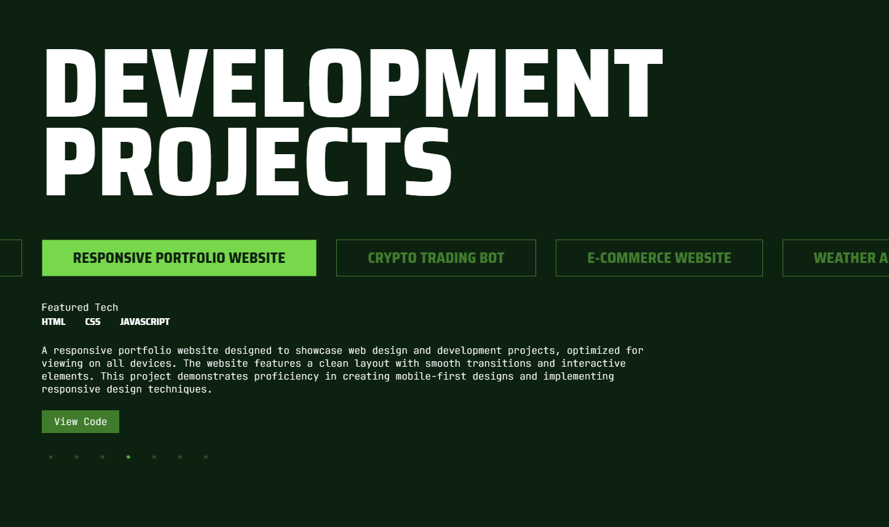

# SlickJS Synced Sliders

This project demonstrates the implementation of synced sliders using SlickJS. The setup includes a main slider and a thumbnail slider that are synchronized. Clicking on a thumbnail updates the main slider, and vice versa.

## Table of Contents

1. [Project Overview](#project-overview)
2. [Screenshots](#screenshots)
3. [Features](#features)
4. [Installation](#installation)
5. [Usage](#usage)
6. [License](#license)

## Project Overview

The SlickJS Synced Sliders project showcases two interconnected sliders: a main slider for detailed project views and a thumbnail slider for quick navigation. Both sliders are synchronized so that selecting an item in one will update the other.

## Screenshots

Here are some screenshots of the synced sliders in action:



## Features

- **Synchronized Sliders**: Main and thumbnail sliders are linked, allowing for seamless navigation between project details.
- **Custom Styling**: The sliders are styled with custom CSS, including hover effects and active state styles.
- **Dynamic Content Loading**: Project data is loaded from a JSON file and dynamically inserted into the sliders.

## Installation

1. **Clone the Repository**

    ```bash
    git clone <repository-url>
    cd <repository-folder>
    ```

2. **Include SlickJS**

   Add the following CDN links to your HTML file:

    ```html
    <!-- Slick CSS -->
    <link rel="stylesheet" href="https://cdnjs.cloudflare.com/ajax/libs/slick-carousel/1.8.1/slick.min.css">
    <link rel="stylesheet" href="https://cdnjs.cloudflare.com/ajax/libs/slick-carousel/1.8.1/slick-theme.min.css">
    ```

    Add SlickJS and jQuery scripts:

    ```html
    <!-- Slick JS -->
    <script src="https://cdnjs.cloudflare.com/ajax/libs/jquery/3.6.0/jquery.min.js"></script>
    <script src="https://cdnjs.cloudflare.com/ajax/libs/slick-carousel/1.8.1/slick.min.js"></script>
    ```

3. **Add the HTML Structure**

    Ensure you include the HTML structure provided in the `index.html` file.

4. **Create `projects.json`**

    Create a `projects.json` file with project data, for example:

    ```json
    [
        {
            "title": "Project 1",
            "description": "Description for project 1.",
            "featuredTech": ["HTML", "CSS", "JavaScript"],
            "link": "https://github.com/example/project1"
        },
        {
            "title": "Project 2",
            "description": "Description for project 2.",
            "featuredTech": ["React", "Node.js"],
            "link": "https://github.com/example/project2"
        }
        // Add more projects as needed
    ]
    ```

## Usage

1. **Open `index.html` in a Browser**

   Ensure your project structure is correctly set up and open `index.html` in a web browser to view the sliders.

2. **Interact with Sliders**

   Click on thumbnails to navigate through projects and see detailed views in the main slider.

## License

This project is licensed under the MIT License - see the [LICENSE](LICENSE) file for details.

